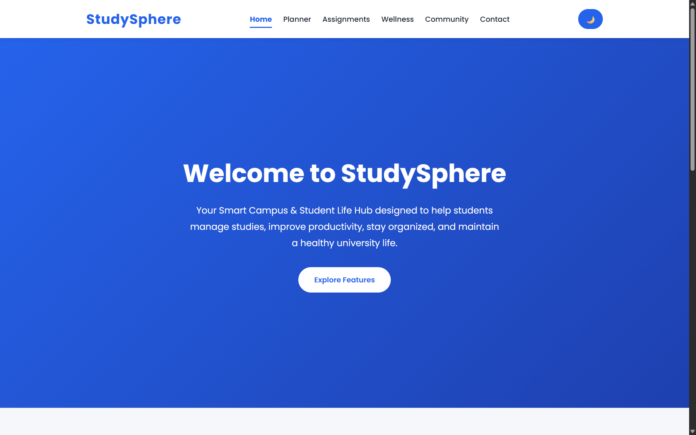
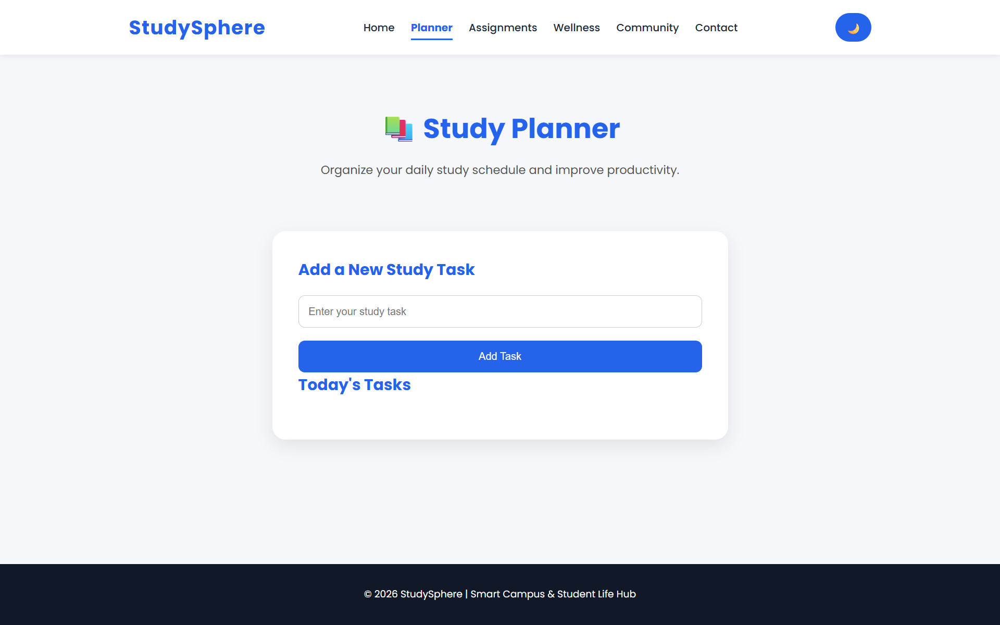
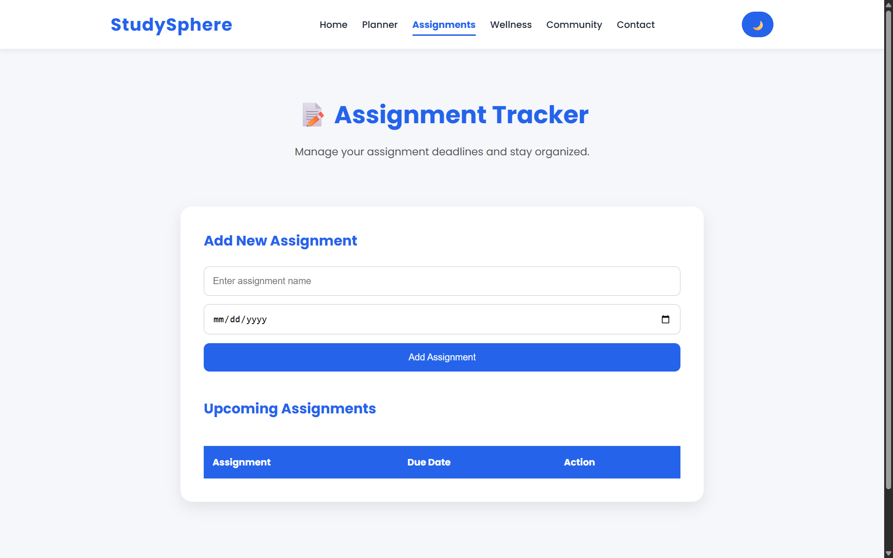
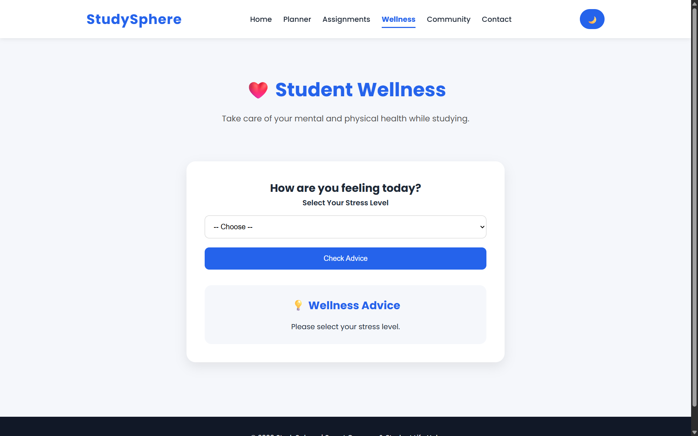
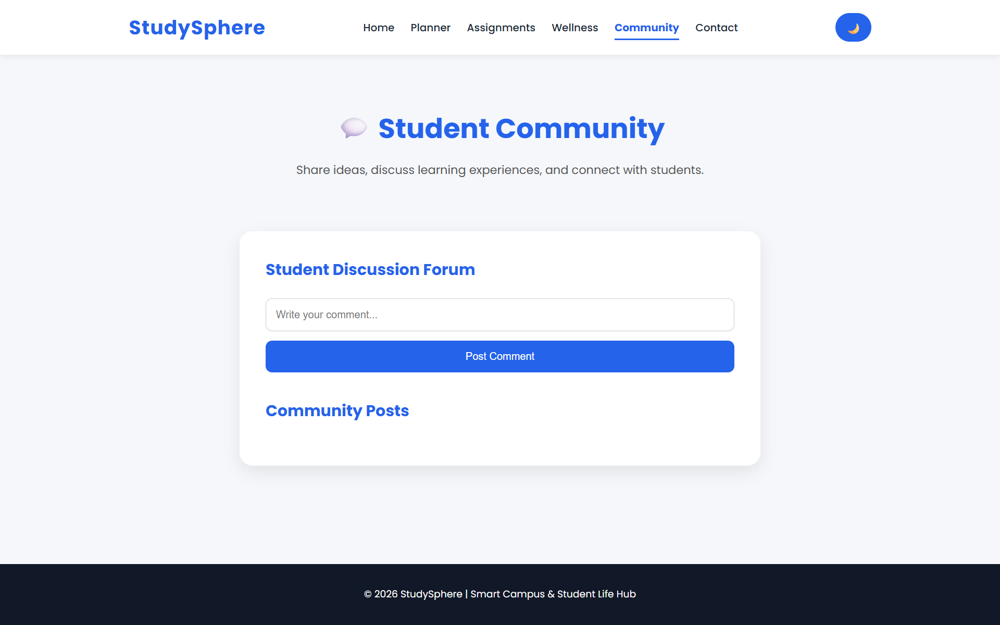
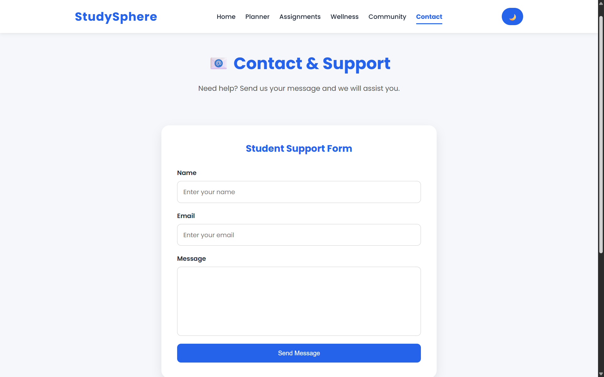

# StudySphere Student Web App

StudySphere is a responsive student-focused web application designed to help students organize academic activities and manage student life features.

## About The Project

This project was developed as a web application using HTML5, CSS3, and JavaScript. It provides a simple and user-friendly interface for managing study-related tasks and improving student productivity.

## Features

- 🏠 Home Page
- 📅 Study Planner
- ✅ Assignment Tracker
- 😊 Wellness Section
- 👥 Community Section
- 📞 Contact Page
- 📱 Responsive Mobile-Friendly Design

## 📸 Screenshots

### 🏠 Home

### 📅 Study Planner

### ✅ Assignment Tracker

### 😊 Wellness

### 👥 Community

### 📞 Contact

## Technologies Used

- HTML5
- CSS3
- JavaScript

## Project Structure

StudySphere

- index.html
- planner.html
- assignments.html
- wellness.html
- community.html
- contact.html
- style.css
- script.js

## Author

**Malinda Yatawarage**

Frontend Web Developer

GitHub:
https://github.com/MalindaYDev
